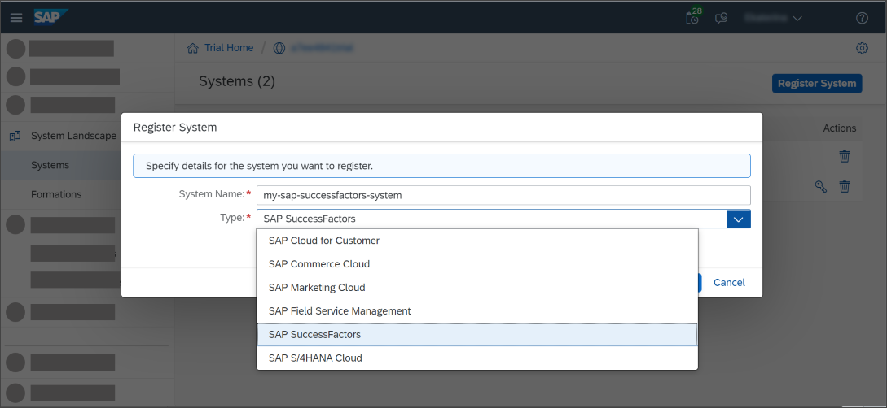
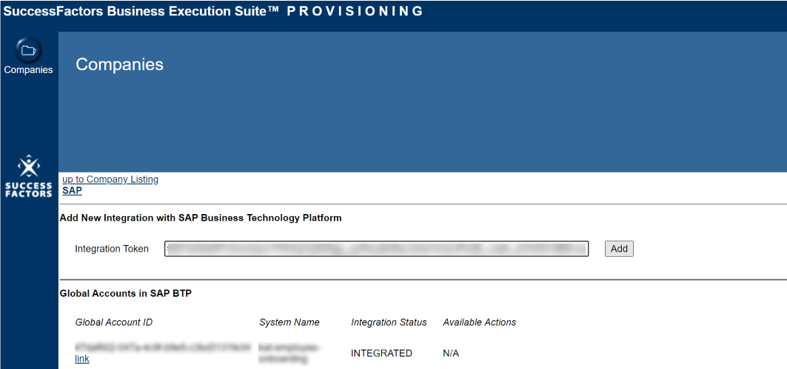
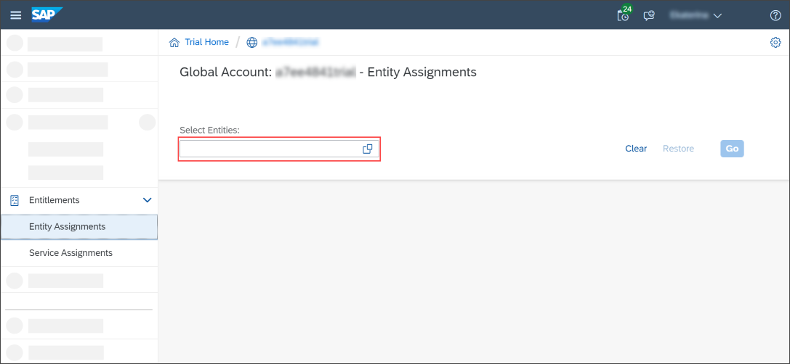
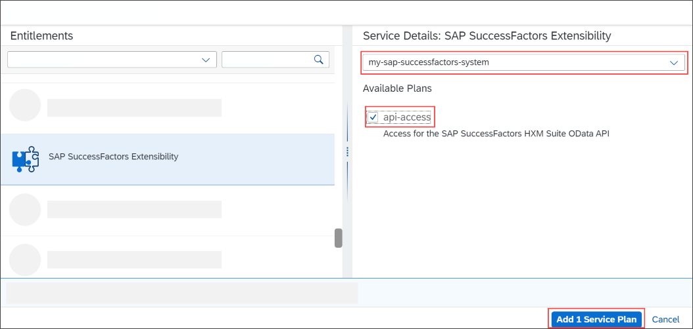
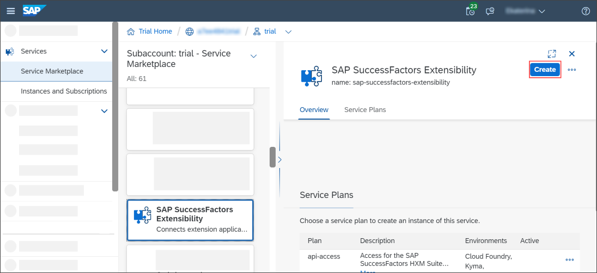
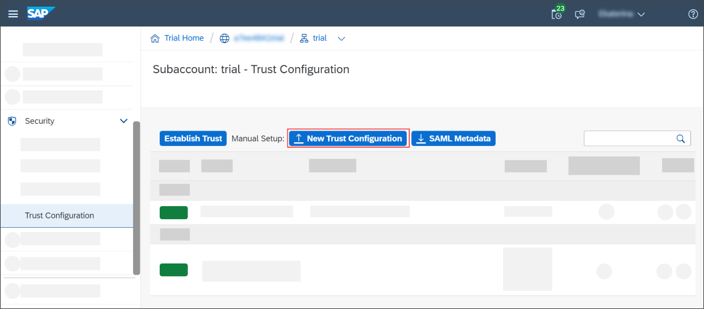
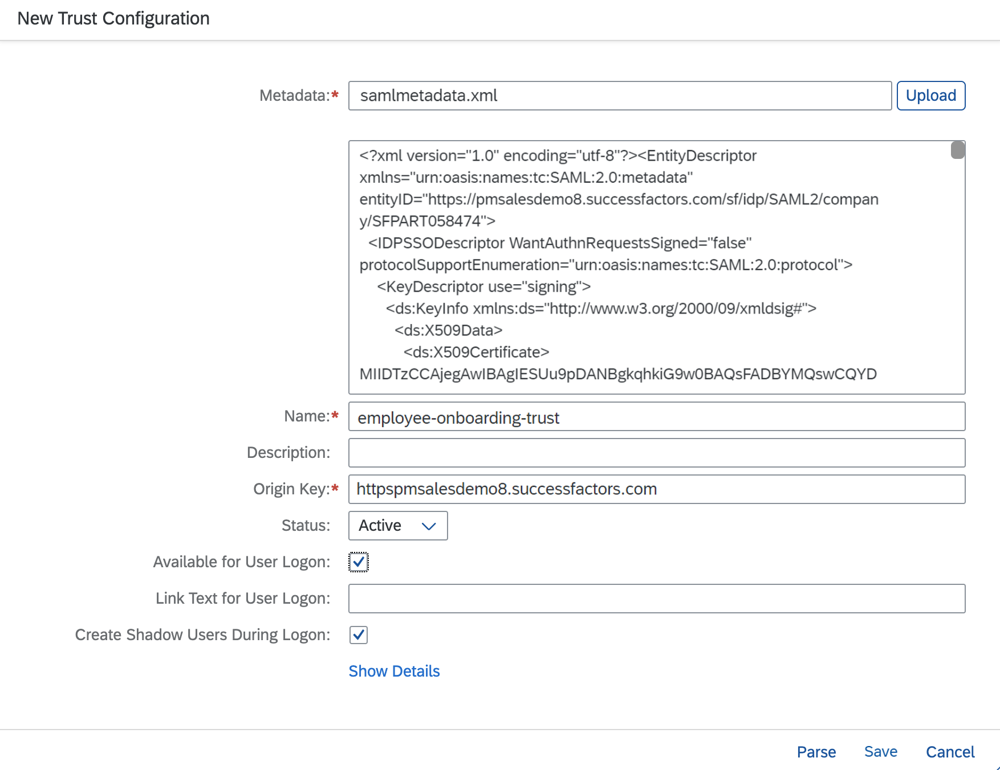
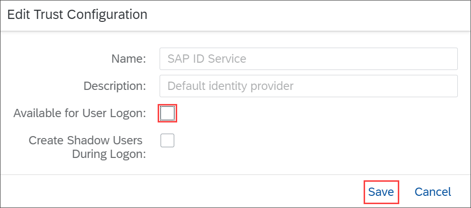
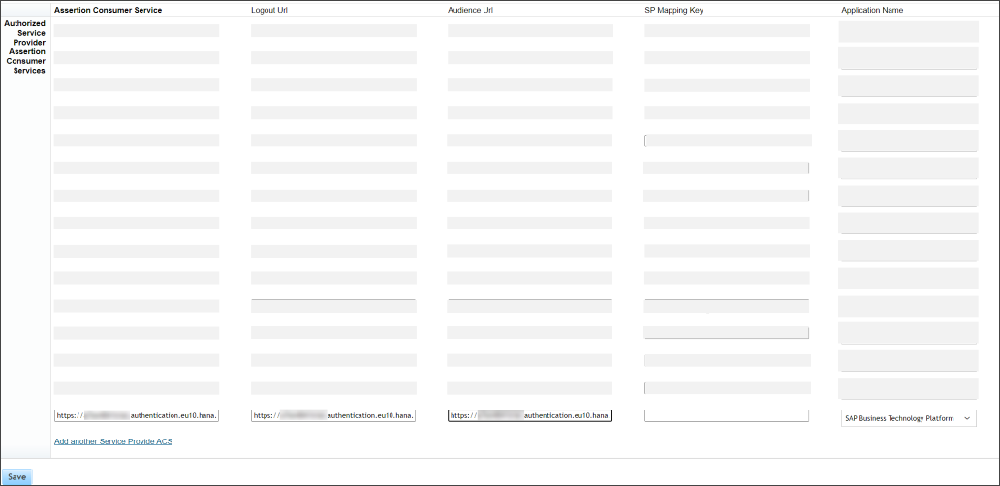

# Task Management Sample Application for SAP SuccessFactors Solutions

[](https://api.reuse.software/info/github.com/SAP/task-management-sample-app-sfsf-solutions)

## Introduction

You can extend the functionality of your SAP SuccessFactors system with an extension application deployed in a subaccount in SAP Business Technology Platform (SAP BTP) and at the same time fully integrated in your SAP SuccessFactors system.

The goal of the **task management sample application for SAP SuccessFactors solutions** is to show some best practices when building SAP SuccessFactors extension applications on SAP BTP. We recommend to use this sample application only as a proof of concept and a starting point for implementing extensions. 

Using this application, you can:
 - Manage different tasks related to human resources (HR), and send them for approval to your colleagues
 - Move the employees in your company from one job title to another.
 - Approve the transfer of employees between positions and departments.
 - Hire new colleagues.

 The following diagram shows the technical components that take part in this scenario. 


## Prerequisites

There are several components and authorizations that you and/or your team members need.

**Tools**

* [JDK 8](https://www.oracle.com/java/technologies/javase/8all-relnotes.html) or later
* [Maven 3.0.x](http://maven.apache.org/docs/3.0.5/release-notes.html) or later
* [Cloud Foundry Command Line Interface (cf CLI)](https://help.sap.com/viewer/65de2977205c403bbc107264b8eccf4b/Cloud/en-US/4ef907afb1254e8286882a2bdef0edf4.html?q=cf%20CLI)
* [git](https://git-scm.com/download/)
* [Lombok](https://projectlombok.org/setup/overview) - if you use an IDE for compilation

**On SAP BTP side:**

* You have either an [enterprise](https://help.sap.com/viewer/65de2977205c403bbc107264b8eccf4b/Cloud/en-US/171511cc425c4e079d0684936486eee6.html) or a [trial](https://help.sap.com/viewer/65de2977205c403bbc107264b8eccf4b/Cloud/en-US/046f127f2a614438b616ccfc575fdb16.html) global account in SAP BTP.
* You have an S-user or P-user (if you are using an enterprise global account), and a trial user (if you are using a trial account). See [User and Member Management](https://help.sap.com/viewer/65de2977205c403bbc107264b8eccf4b/Cloud/en-US/cc1c676b43904066abb2a4838cbd0c37.html?q=user).
* You are an administrator of the global account where you want to register your SAP SuccessFactors system.
* You have enabled the Cloud Foundry capabilities for your subaccount in SAP BTP.

**On SAP SuccessFactors side:**

* You have a dedicated SAP SuccessFactors company instance.
* To configure the integration on the SAP SuccessFactors system side, you need a user with permissions to access SAP SuccessFactors Provisioning.

## Process

### 1. Connect the SAP SuccessFactors system you want to extend with the corresponding global account in SAP BTP

To do that, you must register your SAP SuccessFactors system in your global account in SAP BTP. During this process, an integration token is created and then used by the SAP SuccessFactors system tenant administrator to configure the integration on the SAP SuccessFactors system side.

1. In the SAP BTP cockpit, navigate to your global account, and then choose **System Landscape** > **Systems**.

2. In the **Systems** panel, choose **Register System**.


3. In the **Register** System dialog box:

    1. Enter a name for the system you want to register.
    
     > Use only printable ASCII characters.
    
   

    2. In the **Type** dropdown list, select the system type.
    
   

    3. Choose **Register**.

    > SAP BTP generates an integration token that the tenant administrator of the extended SAP SuccessFactors system uses on the respective SAP SuccessFactors system side when configuring the integration between your SAP SuccessFactors system and the global account in SAP BTP.
    
4. Copy the integration token. You need it for configuring the integration on the extended SAP SuccessFactors system side.

5. Close the dialog box.

   The SAP SuccessFactors system appears in the list of registered systems. Its status is **Pending** because the registration process is not yet completed.
    
6. Open SAP SuccessFactors Provisioning.

7. In the **List of Companies**, choose your SAP SuccessFactors company.

8. In the **Edit Company Settings** section, choose **Extension Management Configuration**.

9. In the **Integration Token** input field, paste the integration token.



10. Choose **Add**.

    Wait for the integration to finish. You can check the status of the process with the **Check Status** button next to your system name.

11. In the SAP BTP cockpit, check the status of the registration process. To do so, navigate to your global account, and on the **Systems** page, check if the status of the SAP system has changed to **Registered**.

If you are already on the **Systems** page, refresh the page to check if the status has changed.

**Note**: You can register a system only once with the same name per global account.


    
See [Register an SAP SuccessFactors System in a Global Account in SAP BTP](https://help.sap.com/viewer/65de2977205c403bbc107264b8eccf4b/Cloud/en-US/e956ba209f30447cb55140e38c15e345.html). 

### 2. Make the SAP SuccessFactors system accessible in the subaccount in SAP BTP in which you want to build your extension application

You need to configure the entitlements for the subaccount where the **task management sample application for SAP SuccessFactors solutions** will be deployed and assign the *api-access* service plan for the SAP SuccessFactors Extensibility service instance to the system you registered in the previous step.

1. In the SAP BTP cockpit, navigate to your global account.

2. In the navigation area, choose **Entitlements** > **Entity Assignments**.

3. Select your subaccount from the **Select Entities:** drop down menu, and then choose **Go**.



4. Choose **Configure Entitlements**.


5. Choose **Add Service Plans**, and then select the **SAP SuccessFactors Extensibility** service.


6. In the **Available Service Plans** area, select the system you have registered and the **api-access** service plan, and then choose **Add Service Plan**.



7. Save the changes. 

See [Configure the Entitlements for the Subaccount in SAP BTP](https://help.sap.com/viewer/65de2977205c403bbc107264b8eccf4b/Cloud/en-US/b01e6255607a42889483115dbd56cc1f.html).

### 3. Configure the Entitlements for the SAP BTP, Cloud Foundry Runtime

1. Make sure you are logged on to SAP BTP cockpit as a Cloud Foundry administrator.

2. In your trial global account, choose **Entitlements** > **Entity Assignments**.

3. If there is no entry for the Cloud Foundry runtime, choose **Configure Entitlements**, and then **Add Service Plans**.

4. In the popup, proceed as follows:

    1. Choose **Cloud Foundry Runtime**.

    2. Under **Available Service Plans**, select the **MEMORY** checkbox.

    3. Choose **Add 1 Service Plan**.


5. On the **Entity Assignments** screen, choose **+** on the **Cloud Foundry Runtime** service row to add at least 1 quota to the subaccount, and then choose **Save**.

### 4. Clone the Task Management Sample Application for SAP SuccessFactors Solutions from GitHub

1. Clone the GitHub repository:

```
git clone https://github.com/SAP/task-management-sample-app-sfsf-solutions
```

2. Configure the details of the SAP SuccessFactors system to which you will connect. To do so, in the root of the project locate the **sap-successfactors-extensibility.json** file and replace the value of the `systemName` parameter with the system name of the system you registered in **Step 1: Connect the SAP SuccessFactors system the corresponding global account in SAP BTP**.

3. In the root of the project locate the **vars.yml** file and replace the values of the following parameters:

  - `ID`. Enter your user in SAP BTP. It is either an S-user, a P-user, or a trial user.

  - `REGION_HOST`. Enter **`eu10.hana.ondemand.com`**. To check the `<region_host>`, go to the SAP BTP cockpit, navigate to the subaccount, go to **Overview** and copy the API endpoint from the **Cloud Foundry** section, and remove the `https://api.cf.`

4. Open a console and navegate to the root folder of the project that is created on you local file system after cloning the GitHub repository.

`cd <root folder of the project>`

5. Build the application. To do so, use the following command:

`mvn clean install`

### 5. Create a Destination Service Instance

To connect the **task management sample application for SAP SuccessFactors solutions** to your SAP SuccessFactors system, you use a destination. For that, you first need to create a Destination service instance using the *lite* service plan. You can do that from [**Cockpit**](#cockpit) or [**Cloud Foundry Command Line Interface (cf CLI)**](#cli):

#### Cockpit

1. In the cockpit, navigate to your subaccount, choose **Services** \> **Service Marketplace**, and on the **Service Marketplace** screen, search for the **Destination** service.

2. From the **Destination** service tile, choose **Create** and follow the steps in the wizard to create the instance.


3. On the **Basic Info** step:

    - Make sure to select the **lite** service plan.

    - In the **Runtime Environment** field, choose **`Cloud Foundry`**.

    - In the **Space** field, select the space you are working with.

    - In the **Instance Name** field, enter **`destination`**.

4. On the **Parameters** step, leave the **JSON** field empty.

5. Choose **Create**.


#### cf CLI

1. Log on to the cf CLI, using this command:

```
cf login -a https://api.cf.eu10.hana.ondemand.com
```

The string `https://api.cf.eu10.hana.ondemand.com` represents the \<api_endpoint\>. To check it, open the SAP BTP cockpit, navigate to the subaccount, go to **Overview** and copy the API endpoint from the **Cloud Foundry** section.

2. Navigate to your Org by typing in the console the number that corresponds to your Org in the list with Orgs that is displayed after you log on to cf CLI.

3. If you have more than one space, navigate to your space, by typing in the console the number that corresponds to your space in the list with spaces.

>If you have only one space, you will be redirected to it right after you specify your Org.

4. Create the Destination service instance, use this command:

`cf create-service destination lite destination`

### 6. Create an SAP SuccessFactors Extensibility Service Instance to Consume the SAP SuccessFactors APIs

To consume the SAP SuccessFactors APIs, you create an SAP SuccessFactors Extensibility service instance using the *api-access* service plan.

During the service instance creation, an HTTP destination on a subaccount level is automatically generated in this subaccount. You use this destination to establish connection to your SAP SuccessFactors system.

Configure the details of the SAP SuccessFactors system to which you will connect. To do so, in the root of the project locate the `sap-successfactors-extensibility.json` file and replace the following parameter:

 - `systemName`

Enter the system name of the system you registered in [Step 1:](Connect the SAP SuccessFactors system you want to extend with the corresponding global account in SAP BTP). 

You can use [**Cockpit**](#cockpit-1) or [**Cloud Foundry Command Line Interface (cf CLI)**](#cli-1):

#### Cockpit

1. In the cockpit, navigate to your subaccount, choose **Services** \> **Service Marketplace**, and on the **Service Marketplace** screen, search for the **SAP SuccessFactors Extensibility** service.

2. From the **SAP SuccessFactors Extensibility** service tile, choose **Create** and follow the steps in the wizard to create the service instance.



3. On the **Basic Info** step:

    - Make sure to select the **api-access** service plan.
    
    - In the **Runtime Environment** field, choose **`Cloud Foundry`**.

    - In the **Space** field, select the space you are working with.

    - In the **System Name** field, select your registered SAP SuccessFactors system.

    - In the **Instance Name** field, enter **`sap-successfactors-extensibility`**.
    


4. On the **Parameters** step, the JSON file is preconfigured. Choose **Next.**


5. Choose **Create**.

#### cf CLI

1. Log on to the cf CLI, using this command:

```
cf login -a https://api.cf.eu10.hana.ondemand.com
```

The string `https://api.cf.eu10.hana.ondemand.com` is the \<api_endpoint\>. To check it, open the SAP BTP cockpit, navigate to the subaccount, go to **Overview** and copy the API endpoint from the **Cloud Foundry** section.

2. Navigate to your Org by typing in the console the number that corresponds to your Org in the list with Orgs that is displayed after you log on to cf CLI.

3. If you have more than one space, navigate to your space, by typing in the console the number that corresponds to your space in the list with spaces.

>If you have only one space, you will be redirected to it right after you specify your Org.

4. Create the SAP SuccessFactors Extensibility service instance, use this command:

`cf create-service sap-successfactors-extensibility api-access sap-successfactors-extensibility -c sap-successfactors-extensibility.json`
      
### 7. Create a Service Instance of the Authorization and Trust Management (XSUAA) Service

To configure the **task management sample application for SAP SuccessFactors solutions** authentication, you create an Authorization and Trust management service instance with **application** service plan. You can do that from [**Cockpit**](#cockpit-2) or [**Command Line Interface (CLI)**](#cli-2):

#### Cockpit

1. In the cockpit, navigate to your subaccount, choose **Services** \> **Service Marketplace**, and on the **Service Marketplace** screen, search for the **Authorization & Trust Management** service.

2. From the **Authorization & Trust Management** service tile, choose **Create** and follow the steps in the wizard to create the service instance.


3. On the **Basic Info** step:

    - Make sure to select the **application** service plan.
    
    - In the **Runtime Environment** field, choose **`Cloud Foundry`**.
    
    - In the **Space** field, select the space you are working with.

    - In the **Instance Name** field, enter **`xsuaa`**.
    


4. On the **Parameters** step, upload the `xsuaa.json` file.


5. Choose **Create**.

#### cf CLI

1. Log on to the cf CLI, using this command:

```
cf login -a https://api.cf.eu10.hana.ondemand.com
```

The string `https://api.cf.eu10.hana.ondemand.com` represents the \<api_endpoint\>. To check it, open the SAP BTP cockpit, navigate to the subaccount, go to **Overview** and copy the API endpoint from the **Cloud Foundry** section.

2. Navigate to your Org by typing in the console the number that corresponds to your Org in the list with Orgs that is displayed after you log on to cf CLI.

3. If you have more than one space, navigate to your space, by typing in the console the number that corresponds to your space in the list with spaces.

>If you have only one space, you will be redirected to it right after you specify your Org.

4. Create the Authorization & Trust Management service instance, use this command:

 `cf create-service xsuaa application xsuaa -c xsuaa.json`

### 8. Build and Deploy the Application

You have to use **Cloud Foundry Command Line Interface (cf CLI)** to deploy and run the **task management sample application for SAP SuccessFactors solutions**.

1. Log on to the cf CLI, using this command:

```cf login -a https://api.cf.eu10.hana.ondemand.com
```

The value `https://api.cf.eu10.hana.ondemand.com` represents the \<api_endpoint\>. To check it, go to the SAP BTP cockpit, navigate to the subaccount, go to **Overview** and copy the API endpoint from the **Cloud Foundry** section. See [Log On to the Cloud Foundry Environment Using the Cloud Foundry Command Line Interface](https://help.sap.com/viewer/65de2977205c403bbc107264b8eccf4b/Cloud/en-US/7a37d66c2e7d401db4980db0cd74aa6b.html).

2. Navigate to your Org by typing in the console the number that corresponds to your Org in the list with Orgs that is displayed after you log on to cf CLI.

3. If you have more than one space, navigate to your space, by typing in the console the number that corresponds to your space in the list with spaces.

>If you have only one space, you will be redirected to it right after you specify your Org.

4. In the cf CLI push the `vars.yml` file using this command:

`cf push --vars-file vars.yml`

### 9. Configure Single-Sign On Between a Subaccount in SAP BTP and SAP SuccessFactors

To ensure the required security for accessing the applications, you need to configure the single sign-on between the subaccount in SAP BTP and the SAP SuccessFactors system using a SAML identity provider. The single sign-on requires both solutions to be configured as trusted SAML service providers for the identity provider, and at the same time, the identity provider to be configured as trusted identity provider for the two solutions.

#### 9.1. Establish trust between an SAP SuccessFactors system and a subaccount in SAP BTP. 

1. Download SAML metadata from the SAP SuccessFactors system.

	1. Go to `https://<sap_successfactors_system>/idp/samlmetadata?company=<company_id>&cert=sha2` where:
		
		- `<sap_successfactors_system>` is the hostname of your SAP SuccessFactors system
		
		- `<company_id>` is the ID of your SAP SuccessFactors company
	
	2. When you are prompted, save the file on your local file system and change its extension to `.xml`.
	
2. Register the SAP SuccessFactors identity provider in the SAP BTP cockpit.

	1. Open the cockpit and navigate to your subaccount.
		
	2. Choose **Security** > **Trust Configuration**.
		
	3. Choose **New Trust Configuration**.
	
	
		
	4. To upload the SAML metadata you downloaded in step 1, choose **Upload**. Browse to the XML file you saved and select it. Some of the fields are automatically filled in.
	
		
	5. In the **Name** field, enter a meaningful name for the trust configuration.
		
	6. Save the changes.
		
3. Make the trust configuration to the SAP SuccessFactors identity provider the only configuration that is available for user logon. To do that, edit all other configurations and unselect the **Available for User Logon** checkbox. Save the change.


	
See [Establish Trust Between SAP SuccessFactors and SAP BTP](https://help.sap.com/viewer/65de2977205c403bbc107264b8eccf4b/Cloud/en-US/80a3fd16d144454fbe08377d284e3c37.html).

#### 9.2. Register the Assertion Consumer Service of the subaccount in SAP SuccessFactors. 

1. Download the service provider SAML metadata file from the SAP BTP cockpit.
	
	1. Go to your subaccount and choose **Security** > **Trust Configuration**.
		
	2. Choose **SAML Metadata** to download an XML file that contains the SAML 2.0 metadata describing SAP BTP as a service provider.
	
	
		
	3. Open the XML file in a text editor and copy the following values:
		
	- The value of the `Location` attribute of the `AssertionConsumerService` element with the HTTP-POST binding of the XML file: this is the value of the Assertion Consumer Service.
	
	
			
	- The value of the `Location` attribute of the `SingleLogoutService` element with the HTTP-POST binding of the XML file: this is the value of the logout URL.
	
	
			
	- The value of the `EntityID` attribute of `EntityDescriptor` element of the XML file: this is the value of the Audience URL.
	
	
			
2. In Provisioning of SAP SuccessFactors, go to your company and choose **Authorized SP Assertion Consumer Service Settings** under the **Service Provider Settings** section.
	
3. Choose **Add another Service Provider ACS** and fill in the following fields:

	- `Assertion Consumer Service` field
		
	The assertion consumer service URL

	This is the value of the `Location` attribute of the `AssertionConsumerService` element with the HTTP-POST binding you copied in step 1.

	- `Logout URL` fields
		
	The logout URL

	This is the value of the `Location` attribute of the `SingleLogoutService` element with the HTTP-POST binding you copied in step 1.
		
	- `Audience Url` field
		
	The audience URL

	This is the value of the `EntityID` attribute of `EntityDescriptor` element you copied in step 1
		
	- `Application Name` field
	
	Select `SAP Business Technology Platform` from the dropdown menu.
	
	
		
See [Register the Assertion Consumer Service of the Subaccount in SAP BTP in SAP SuccessFactors](https://help.sap.com/viewer/65de2977205c403bbc107264b8eccf4b/Cloud/en-US/de3a1b3d12fb449e9ff0a528db6ae4b4.html).


### 10. Test the Application


1. In the SAP BTP cockpit, navigate to **<your_Cloud Foundry_space>** > **Applications**, and then choose the **approuter-task-management** link to go to the **Overview** page of the application.

2. On the **approuter-task-management - Overview** page, choose the URL in the **Application Routes** screen area to open the application in your browser.
   
Alternatively, copy and paste this URL from **routes** property in a browser from **cf CLI** when execute the command:

      cf app approuter-task-management
      
## Licensing

Copyright 2021 SAP SE or an SAP affiliate company and task-management-sample-app-sfsf-solutions contributors. Please see our [LICENSE](LICENSE) for copyright and license information. Detailed information including third-party components and their licensing/copyright information is available [via the REUSE tool](https://api.reuse.software/info/github.com/SAP/task-management-sample-app-sfsf-solutions).
